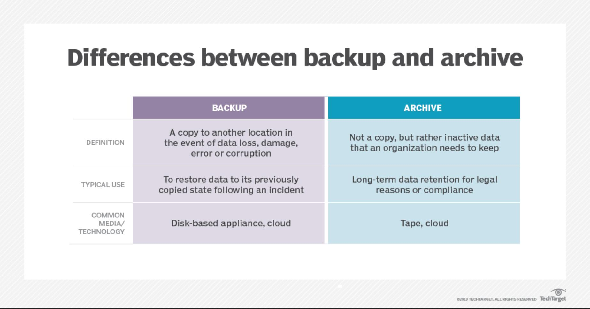

# Introduction
[source](https://github.com/silinternational/policy-on-data-retention)

_The contents of this introduction are copied and edited from [TechTarget (https://www.techtarget.com/searchdatabackup/definition/data-retention-policy)](https://www.techtarget.com/searchdatabackup/definition/data-retention-policy):_

## What is a data retention policy?

A data retention policy, or records retention policy, is an organization's established protocol for retaining information for operational or regulatory compliance needs.

## Why is a data retention policy important?
A policy is important because data can pile up dramatically, so it's crucial to define how long an organization must hold on to specific data.  An organization should **only retain data for as long as it's needed**, whether that's six months or six years. Retaining data longer than necessary takes up unnecessary storage space and costs more than needed.

## What are the benefits of a data retention policy?

There are numerous benefits to establishing a solid data retention policy. Some of the more compelling benefits include:

  - Automated compliance. With an established policy, organizations can ensure they comply with regulatory requirements mandating the retention of various types of data.
  - Reduced likelihood of compliance related fines. Even if an organization retains all the data that's legally required, the organization must be able to produce that data if it's requested by auditors. Retaining only the minimally required volume of data makes it easier and less time-consuming to locate this data, thereby reducing the chances that an organization is fined for its inability to produce data that's required to be retained.
  - Reduced storage costs. There's a direct cost associated with data storage and reducing the volume of data that is being stored also reduces storage costs.
  - Increased relevancy of existing data. Data becomes less relevant as it ages, and a data retention policy removes irrelevant data that's no longer needed.
  - Reduced legal exposure. Once data is no longer needed, it's removed, eliminating the possibility that the data can be surfaced during legal discovery and used against the organization.

## What are data retention policy best practices?

When it comes to creating a data retention policy, every organization's needs are different. Even so, there are several best practices that organizations should adhere to when establishing a data retention policy. Some of these best practices include:

**Identifying legal requirements.** Organizations must determine the laws and regulations that govern their data retention requirements so those requirements can be incorporated into the data retention policy.

**Identifying business requirements.** Creating an effective data retention policy involves more than just complying with applicable regulations. The retention policy must also take the organization's business requirements into account. It could be that there are operational requirements that mandate retaining data for longer than what's legally required.

**Considering data types when crafting a data retention policy.** In any organization some data is more valuable than other data. An organization should avoid creating a blanket data retention policy that applies to all types of data. Instead, the policy should specifically define the type of data that must be retained and establish retention requirements for each type.

## How do you create a data retention policy?

Creating a data retention policy is rarely a simple process and some organizations might find it better to outsource the policy creation and implementation process rather than doing it internally. For organizations creating their own data retention policies, there are 10 basic steps:

1. Decide who'll be responsible for creating the policy. This task won't usually be handled by a single person in the organization because it requires expertise in various areas. Typically, the data retention policy creation process is a team effort with members of the IT staff, the organization's legal department and other key stakeholders.
2. Determine the organization's legal requirements. The policy must meet or exceed the requirements outlined in any regulations that apply to the organization. Identify the legal requirements upfront, as they'll be the foundation of the policy.
3. Define the organization's business requirements. This means identifying various types of data and figuring out how long each data type should be retained. Typically, data is active for a period, then moved to archival storage and eventually purged from the archive as a part of the organization's data lifecycle management process.
4. Determine who'll be responsible for ensuring that data retention is being performed according to the policy.
5. Determine how to perform internal audits to ensure policy compliance.
6. Decide the frequency with which the data retention policy should be reviewed and revised.
7. Work with the organization's HR or legal departments to establish a means of enforcing the policy.
8. Determine how the data retention requirements are implemented and enforced at a software level.
9. Write the official data retention policy.
10. Once the policy has been drafted, present the policy to key stakeholders for approval.

## Proper implementation

The operational reason for implementing a data retention policy involves proper data backup. An organization's backup data helps it recover in the event of data loss. A policy is important to make sure the organization has the right data and the right amount of data backed up. Too little data backed up means the recovery won't be as comprehensive as needed, while too much causes confusion.

A data retention policy should treat archived data differently from backup data. Archived data is no longer actively used by the organization, but still needed for long-term retention. An organization might need data shifted to archives for future reference or for compliance. Archives are stored on cheaper storage media, so they reduce costs and the volume of primary data storage. A user should be able to search archives easily.

